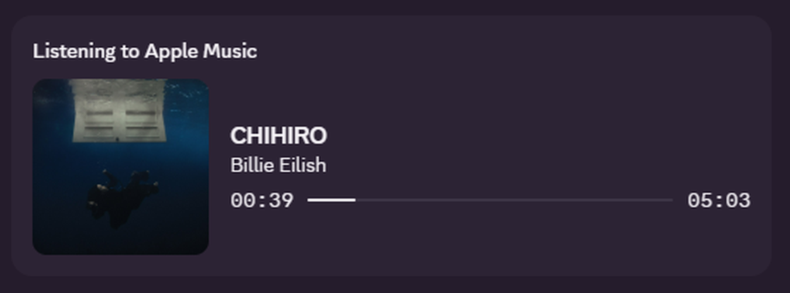
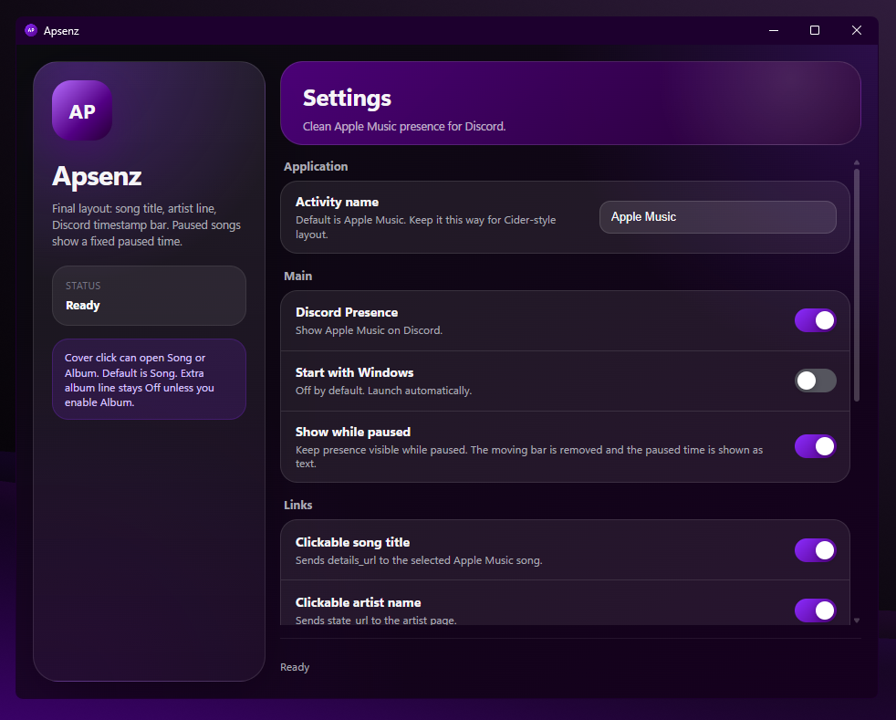
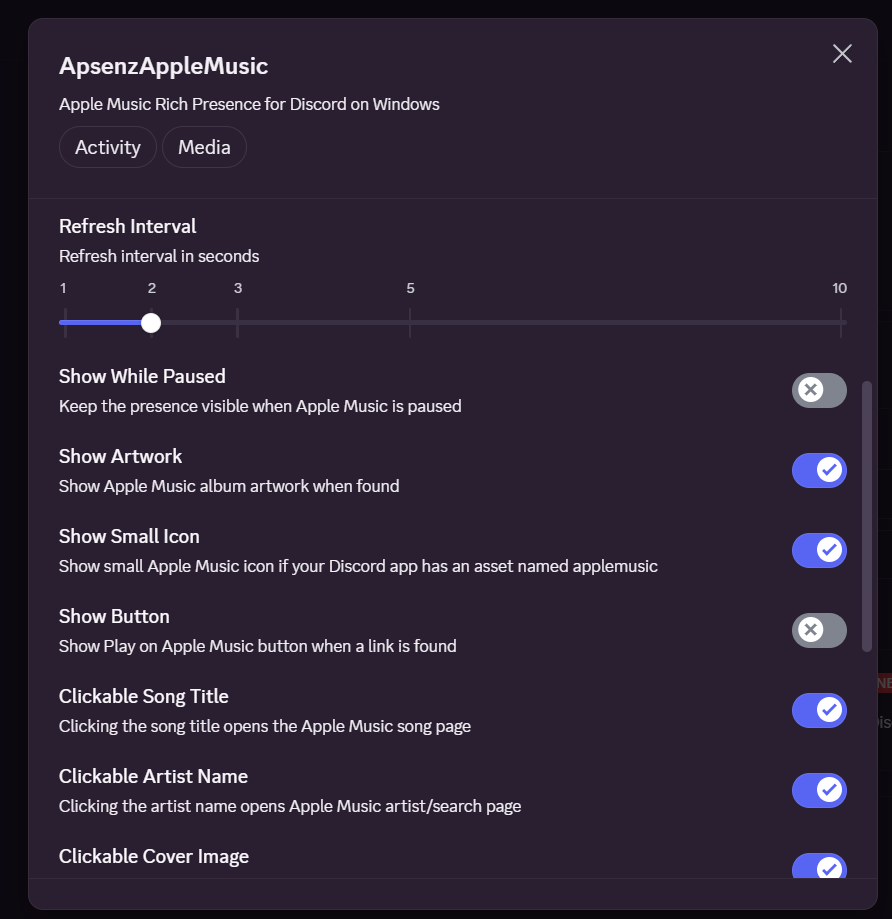
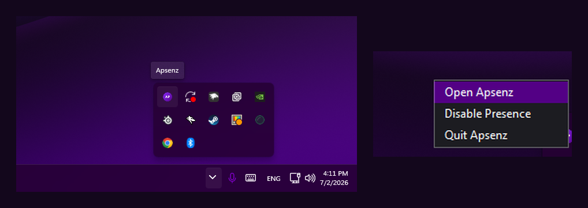

# Apsenz Apple Music

**Apple Music Rich Presence for Discord on Windows.**

Apsenz Apple Music shows your current Apple Music track on Discord with song title, artist, album artwork, and progress.

## Recommended

Use the **Vencord Plugin** if you already use Vencord.

The Windows desktop app is included as an optional standalone version.

## Download

Get the latest version from the release page:

https://github.com/Apsenz/Apsenz-Apple-Music/releases/latest

### Recommended: Vencord Plugin

Download:

`ApsenzAppleMusic_Vencord_Plugin.zip`

Use this if you already use Vencord. This is the recommended option.

### Windows Desktop App

Download:

`Apsenz-Apple-Music-windows-x64-installer.exe`

Use this if you want a normal Windows app with an installer.

## Install Vencord Plugin

1. Download `ApsenzAppleMusic_Vencord_Plugin.zip`.
2. Extract the ZIP.
3. Run `ApsenzAppleMusic-installer.bat`.
4. Restart Discord.
5. Enable `ApsenzAppleMusic` in Vencord plugins.

## Uninstall Vencord Plugin

Run `ApsenzAppleMusic-uninstaller.bat`.

## Privacy

Apsenz Apple Music is designed to use Apple Music only.

It should not show YouTube, browser videos, or other media apps in Discord Rich Presence.

Read more: [PRIVACY.md](PRIVACY.md)

More screenshots

### Windows Desktop App

### Vencord Plugin Settings

### Tray App

## Support

Read: [SUPPORT.md](SUPPORT.md)

Server Discord https://discord.gg/k5zFTFjEhU

## License

MIT
